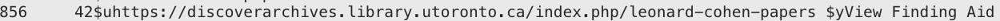

This page documents how finding aid/metadata in the Discover Archives service (currently AtoM) relates with discovery in the University of Toronto Onesearch catalog (currently Alma/Primo).

## Table of contents

- [Background](#background)
- [Recommendations for MARC records](#recommendations-for-marc-records)
- [Relevant documentation](#relevant-documentation)

## Background

The Discover Archives service began as a pilot in 2014. It launched as a service in 2018. 

Prior to 2014, U of T archives had different practices for promoting archival description to different discovery points. You can read more about the metadata and discovery goals that were part of developing the Discover Archives service at U of T in [this paper](https://kula.uvic.ca/index.php/kula/article/view/234). 

Prior to the existence of Discover Archives, some U of T archives published MARC records in the U of T library catalog. 

Currently, the Discover Archives Steering Committee is consulting with the LSP team and LSP Discovery working group to investigate how the Discover Archives API feed can feed top-level finding aids into Primo to assist in promoting the discovery of local U of T archival records in the U of T library catalog.

**This page will be updated with additional details as the investigation continues.**

## Recommendations for MARC Records

Some Discover Archives repositories have archival fonds/collections with [corresponding MARC records in the U of T library catalog](https://librarysearch.library.utoronto.ca/discovery/search?query=any,contains,discoverarchives.library.utoronto.ca&tab=Everything&search_scope=UTL_AND_CI&vid=01UTORONTO_INST:UTORONTO&offset=0).

**If your DASC repository currently creates MARC records for archival material described in Discover Archives pleasure follow these MARC record recommendations:** 

### 1) In the MARC Leader/06 field use resource type "p"

Resource type "p" corresponds to the ["Mixed material" resource type](https://www.itsmarc.com/crs/mergedprojects/helptop1/helptop1/directory_and_leader/idh_leader_06_bib.htm), the most relevant type for top-level archival fonds or collections descriptions.

In the UTL catalog, resource type "p" will display under the "Format" facet as "Archives @ U of T". 

Sample MARC records for Discover Archives finding aids:
* [Kathleen Parlow fonds](https://librarysearch.library.utoronto.ca/discovery/sourceRecord?vid=01UTORONTO_INST:UTORONTO&docId=alma991107320546406196&recordOwner=01UTORONTO_INST)
* [James Pidduk papers](https://librarysearch.library.utoronto.ca/discovery/sourceRecord?vid=01UTORONTO_INST:UTORONTO&docId=alma991106523295806196&recordOwner=01UTORONTO_INST)

### 2) In the MARC 856 field, add the description's finding aid URL

Please consistently encode the [856 field](https://www.loc.gov/marc/bibliographic/bd856.html) when you do this:
* Use 4 as the First Indicator
* Use 2 as the Second Indicator (the finding aid in Discover Archives is consider a related resource)
* Use subfield $u to add the full and valid URL to the finding aid in Discover Archives (double check the URL)
* Use subfield $y (856 subfield $y is for "Link Text") to add the text "View Finding Aid"

^ these recommendations may evolve and change as the U of T catalog evolves and in consultation with the U of T LSP team and Metadata Services. 

A reminder that these 856 URLs are searchable via the Onesearch search bar. For example, [click here](https://librarysearch.library.utoronto.ca/discovery/search?query=any,contains,discoverarchives.library.utoronto.ca&tab=Everything&search_scope=UTL_AND_CI&vid=01UTORONTO_INST:UTORONTO&offset=0) to search for any MARC record that contains the text "discoverarchives.library.utoronto.ca" in Onesearch.

## Relevant Documentation

This list is not exhaustive but includes some of the resources we have pulled together when investigating Alma, Primo, AtoM, and relevant standards (DC, EAD, MARC)

From Ex Libris Community
--------
* [Configuring Import Profiles for Primo VE](https://knowledge.exlibrisgroup.com/Primo/Product_Documentation/020Primo_VE/045Loading_Records_from_External_Sources_into_Primo_VE/Configuring_Import_Profiles_for_Primo_VE)
* [External Data Sources](https://proquestmeetings.webex.com/proquestmeetings/lsr.php?RCID=0a3cb3e135164e0abdf10f948eb86b2f)
* [Add Discovery Profile in Primo sandbox](https://knowledge.exlibrisgroup.com/Primo/Product_Documentation/020Primo_VE/045Loading_Records_from_External_Sources_into_Primo_VE/Configuring_Import_Profiles_for_Primo_VE) - refer to this documentation to check how to map out each Discover Archives repository record to their corresponding Library in Alma/Primo

From AtoM Community
--------
* [OAI Repository (AtoM Documentation)](https://www.accesstomemory.org/docs/latest/user-manual/import-export/oai-pmh/)
* [https://digital-archiving.blogspot.com/2016/11/atom-harvesting-part-1-it-works\_2.html](https://digital-archiving.blogspot.com/2016/11/atom-harvesting-part-1-it-works_2.html)
* [https://digital-archiving.blogspot.com/2017/02/harvesting-ead-from-atom-collaborative\_39.html](https://digital-archiving.blogspot.com/2017/02/harvesting-ead-from-atom-collaborative_39.html)
* [https://digital-archiving.blogspot.com/2017/09/harvesting-ead-from-atom-we-need-your\_27.html](https://digital-archiving.blogspot.com/2017/09/harvesting-ead-from-atom-we-need-your_27.html)
* Queen's slides from [2023 Collaborative Futures Mini-Conference](https://ocul.on.ca/cf-mini-conference-summer-2023) - [https://ocul.on.ca/sites/default/files/3.%20Heil%20and%20Han\_AtoM%20to%20Omni\_CFMiniConference\_2023-06-05.pdf](https://ocul.on.ca/sites/default/files/3.%20Heil%20and%20Han_AtoM%20to%20Omni_CFMiniConference_2023-06-05.pdf)

AtoM Google Group Threads
--------
* [https://groups.google.com/d/msg/ica-atom-users/i5Z2lMy-bx0/hpuLpS9LBgAJ](https://groups.google.com/d/msg/ica-atom-users/i5Z2lMy-bx0/hpuLpS9LBgAJ)
* [https://groups.google.com/d/msg/ica-atom-users/-dHdeQzDw0A/-F2x5MfpAQAJ](https://groups.google.com/d/msg/ica-atom-users/-dHdeQzDw0A/-F2x5MfpAQAJ)

Examples
--------

* [University of Strathclyde (Glasgow)](http://suprimo.lib.strath.ac.uk/permalink/f/utkvjl/SUARCHIVESESU_120)
    * [Source record (in DC XML)](http://suprimo.lib.strath.ac.uk/primo-explore/sourceRecord?vid=SUNU01&docId=SUARCHIVESESU_120)
    * [Example of what things look like in Search Results page](https://suprimo.lib.strath.ac.uk/primo-explore/search?query=sub,exact,%20Urban%20planning,AND&vid=SUNU01&mode=advanced)
    * Indicates 'Available via Archives and Special Collections reading room'
    * Note that Discover Archives will likely use "View Finding Aid" instead of "Online Access" 
* University of York, UK: [https://yorsearch.york.ac.uk/permalink/f/1kq3a7l/44YORK\_ATOM\_DSGB193\_49378](https://yorsearch.york.ac.uk/permalink/f/1kq3a7l/44YORK_ATOM_DSGB193_49378)
    * They've customized the 'Resource Type' field to be called 'Borthwick Finding Aid'
* [National Library of Wales](https://discover.library.wales/permalink/f/1norb00/44NLW_ATM_510564)
* [Queen's U at Kingston](https://ocul-qu.primo.exlibrisgroup.com/permalink/01OCUL_QU/r9dor2/alma9952745342605158)
* [University of York notes on harvesting nightly](https://digital-archiving.blogspot.com/search?q=atom%20harvesting%20part%201%20it%20works))
   * University of York only does top-level / but their aim is to direct users to the actual AtoM instance to navigate descriptions hierarchically: _"If we had enabled the harvesting of all levels of records, there was a risk that search results would have been swamped by hundreds of lower level records from those archives that have been fully catalogued. This would have made the search results difficult to understand, particularly given the fact that these results could not have been displayed in a hierarchical way so the relationships between the different levels would be unclear. We would still encourage users to go direct to the [Borthwick Catalogue](https://borthcat.york.ac.uk/) itself to search and browse lower levels of description."_ ([https://digital-archiving.blogspot.com/search?q=atom%20harvesting%20part%201%20it%20works](https://digital-archiving.blogspot.com/search?q=atom%20harvesting%20part%201%20it%20works))

Crosswalk
--------

*   [https://www.accesstomemory.org/en/docs/latest/user-manual/data-templates/dc-template/](https://www.accesstomemory.org/en/docs/latest/user-manual/data-templates/dc-template/) - these are the only fields from ISAD(G) that will show up in the DC XML

