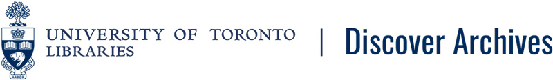

# *Discover Archives* policies and documentation

*[Discover Archives](https://discoverarchives.library.utoronto.ca/)* is a shared portal for exploring archival holdings at the University of Toronto and its federated colleges. *Discover Archives* currently uses the [Access to Memory (AtoM) platform](https://www.accesstomemory.org/en/docs/latest/).

This site contains public policy & procedures documentation. 
* Additional documentation for staff is available on xWiki.  
* Documentation for users / researchers using and searching in *Discover Archives* can be found in [this guide](https://guides.library.utoronto.ca/discover_archives_searchtips). 